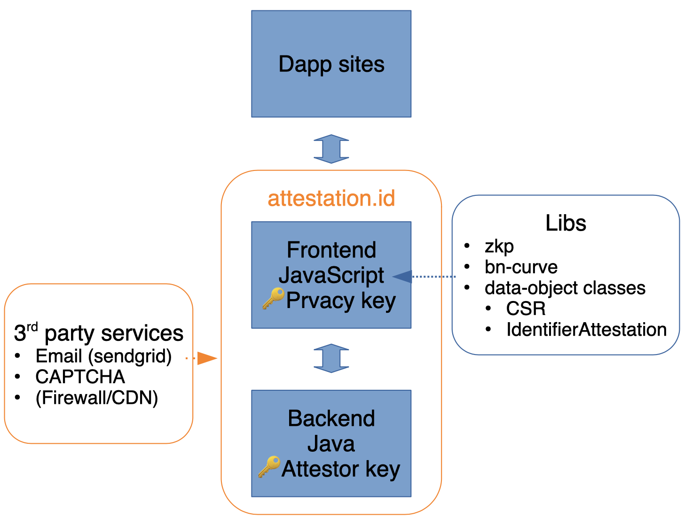

# attestation.id attestor site

This repo has the source code for attestation.id attestor site.

## Architecture

## Directories

The directories in this repo:

- frontend: frontend code of this site which is a svelte project.
- backend: backend code providing restful serivce, which is a micronaut project

### Requirements

- backend: Currently the backend is known to work with JDK 11 and JDK 13. Only JRE 11 is used in the production environment.

---

Milestone for reference is beblow.

## Stage 1 Goal

- User access attestation.id and finalising the process by downloading the identifier attestation and the privacy key.
- In order to remove the dependency of data-object classes, the website is not required to:
  -- Generate CSR according to [CSR.asn](https://github.com/TokenScript/attestation/blob/main/data-modules/output/asn/CSR.asn) - just send the data fields in CSR to the server will do for now.
  -- Parse the attestation data object according to [IdentifierAttestation.asn](https://github.com/TokenScript/attestation/blob/main/data-modules/output/asn/IdentifierAttestation.asn) - just provide the raw data (DER file) for download
  -- Save the Privacy Key (not Private Key) in pem format - just save it as raw 256 bits of unsigned data
- As soon as data object classes are provided, the above items should be amended.

## Stage 2 Goal

- saving both _Identifier Attestation_ and _Privacy Key_ in local storage.
- attestation.id code works with the Negotiator and Authenticator (will be produced in a month or more)
- attestation.id works as modal

## Stage 3 Goal

- Implement [Capability attestation](http://tokenscript.org/Capability.html)
